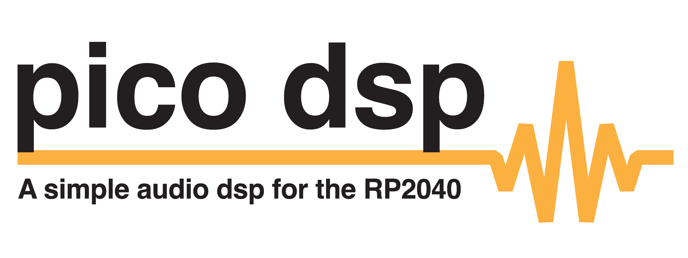
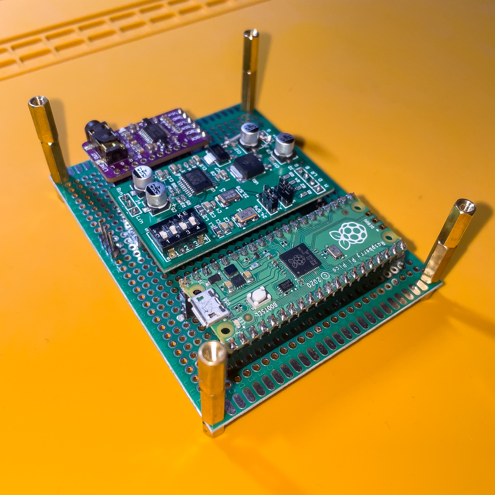

# PICO-DSP

<p align="center" style="background-color: white;">
  
</p>

## Functionality

Audio DSP Project for the Raspberry Pi Pico (RP2040).
The project reads an I2S input stream, performs signal processing and outputs it as an I2S stream.
The pico acts as the I2S master generating all required clocks (including MCLK).

DSP is done at 44.1kHz at 32 Bits fixed point.
Fixed point is a hard requirement, as the RP2040 doesn't have an FPU.
Running just one floating point IIR filter would require overclocking the core to 230MHz.

## Usage

### Firmware

The I2S interfaces are realized via the PIOs.
The project takes strong influence from the [`pico-extras`](https://github.com/raspberrypi/pico-extras) and the [`arduino-pico`](https://github.com/earlephilhower/arduino-pico) repositories.

The I2S communication works by using 3 PIOs.
One transmitter, one receiver and a clock generator.
The transmitter and receiver are clocked at the bitclock frequency (Bits * Channels * FS), while MCLK is run at it's own frequency (x * FS).
These are synchronized using IRQ7.
This could perhaps be consolidated into just two or even only one PIO.

### Hardware

**Use the DAC Clocks (DAC WS and DAC BCK) for both the ADC and DAC**.
The ADC Clocks are shifted by one `nop` statement.

<p align="center">
  
  <br>
  
</p>

The test PCB consists of a Raspberry Pi Pico, a PCM5102A and a WM8782S on development boards.
The ADC and DAC boards are supplied with +5V from the pico's VBUS connection.
The ADC board requires a jumper between the V+ input and the secondary voltage regulator input to bypass the first regulator.
(The primary regulator steps V+ down to +5V, as VBUS is 5V and the dropout voltage is greater than 0V, I opted to bypass it.)

The ADC is configured as:
- Slave mode
- Slave clock MCLK input (J3 = S, J1 = Don't care)
- I2S bit format
- 44.1K/48K sample rate
- 24 bit

The DAC board has no modifications and is left as-is (1L, 2L, H3, 4L).

## Building and Compilation

Requires pico-sdk and pico-extras.

```bash
mkdir build
cd build
cmake ..
make
```

Proceed to flash the pico with the generated `.elf`.

## TODO

- [ ] hardware documentation
- [ ] restructure Ringbuffer ?
- [ ] Add more DSP functionality
- [x] Cleanup unused clock outputs (I2S PIO In)
- [x] try to optimize performance
- [ ] more docs

## Further resources

- The great [earlevel engineering blog](https://www.earlevel.com/main/) is a great resource for IIR Filters and various DSP subjects.
- My own projects [ESP32 Bluetooth DSP](https://github.com/playduck/esp32-bluetooth-dsp) and it's [DSP Playground](https://github.com/playduck/dsp-playground) are peers to this project.
